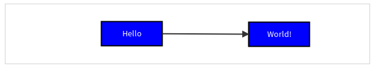

## Introduction

JointJS图表库可以让你仅仅依赖JavaScript和SVG，就能为所有现代浏览器创建完全交互式的图表工具。它的MVC（其实更多是MV）架构将graph, element 和 link模型与它们的渲染分离开来，这使得JointJS更易于集成到后端应用程序中。

JointJS使用Backbone MVC库构建，并使用jQuery和Lodash。

JointJS中的图表由Graph模型（joint.dia.Graph）表示，您可以在其中添加cells的模型 ——可以是Elements（joint.dia.Element的子类型），也可以是Links（joint.dia.Link的子类型）。为了显示图表，需要将其附加到Paper视图（joint.dia.Paper）。从版本0.6开始，您只需要处理模型，而不用处理视图；paper会从graph模型提供的数据中生成ElementViews和LinkViews。该体系结构如下图所示：


JointJS提供了常见几何形状（如矩形、圆、椭圆）的可视化库，以及几种著名的图表语言（ERD，OrgChart，FSA，UML，PN，DEVS ......）所包含的大量现成组件。JointJS框架的设计注重模块化，这使高级用户可以轻松创建自己的形状并使用自定义插件扩展内置功能。

Rappid是JointJS的商业版本，提供了许多预制插件，可通过小部件，交互组件和其他形状（如BPMN图）扩展其功能。  

## 创建基础JointJS图表

官网给出的的示例，效果如下：



该程序执行JointJS应用程序需要执行的所有操作以生成可视输出：

1. **包含JointJS及其依赖**
2. **定义一个graph和一个paper**
3. **创建2个矩形elements**
4. **创建一个link来连接elements**

下面，我们一步一步来创建这个基础的JointJS图表。

### step 1.  Installation

要运行JointJS应用程序，必须将JointJS库及其依赖项包含在页面的源HTML中。

1. 方式一：使用CDN，链接到JointJS，jQuery，Lodash和Backbone所需的源文件。

看官方的例子：

```html
<!DOCTYPE html>
<html>
<head>
    <link rel="stylesheet" type="text/css" href="https://cdnjs.cloudflare.com/ajax/libs/jointjs/2.1.0/joint.css" />
</head>
<body>
    <!-- content -->
    <div id="myholder"></div>

	<!-- 1.包含JointJS及其依赖（jQuery,lodash,Backbone）-->
    <!-- dependencies-->
    <script src="https://cdnjs.cloudflare.com/ajax/libs/jquery/3.1.1/jquery.js"></script>
    <script src="https://cdnjs.cloudflare.com/ajax/libs/lodash.js/3.10.1/lodash.js"></script>
    <script src="https://cdnjs.cloudflare.com/ajax/libs/backbone.js/1.3.3/backbone.js"></script>
    <script src="https://cdnjs.cloudflare.com/ajax/libs/jointjs/2.1.0/joint.js"></script>

    <!-- code -->
    <script type="text/javascript">
    </script>
</body>
</html>
```

1. 方式二：本地安装JointJS。如果已经安装了NPM，运行 

   ```javascript
   npm install --save jointjs
   ```

   然后，在生成的node_modules文件夹中的各自文件夹中找到所有必需的源文件。代码段将如下所示：

   ```html
   <!DOCTYPE html>
   <html>
   <head>
       <link rel="stylesheet" type="text/css" href="node_modules/jointjs/dist/joint.css" />
   </head>
   <body>
       <!-- content -->
       <div id="myholder"></div>
   
       <!-- dependencies -->
       <script src="node_modules/jquery/dist/jquery.js"></script>
       <script src="node_modules/lodash/index.js"></script>
       <script src="node_modules/backbone/backbone.js"></script>
       <script src="node_modules/jointjs/dist/joint.js"></script>
   
       <!-- code -->
       <script type="text/javascript">
       </script>
   </body>
   </html>
   ```

   现在JointJS已经包含在我们的页面中，接下来可以开始构建我们的图表了。

   ### step 2.  Create graph & paper

   **所有有用的JointJS应用程序都需要有graph和paper**。graph包含了对图表的的所有组件的引用，paper负责图表的渲染。

   在code部分，script标签中，创建一个graph对象和一个paper对象。

   ```javascript
    <!-- code -->
       <script type="text/javascript">
   
           var graph = new joint.dia.Graph;
   
           var paper = new joint.dia.Paper({
               el: document.getElementById('myholder'),
               model: graph,
               width: 600,
               height: 100,
               gridSize: 1
           });
           
           var rect = new joint.shapes.standard.Rectangle();
           rect.position(100, 30);
           rect.resize(100, 40);
           rect.attr({
               body: {
                   fill: 'blue'
               },
               label: {
                   text: 'Hello',
                   fill: 'white'
               }
           });
           rect.addTo(graph);
   
           var rect2 = rect.clone();
           rect2.translate(300, 0);
           rect2.attr('label/text', 'World!');
           rect2.addTo(graph);
   
           var link = new joint.shapes.standard.Link();
           link.source(rect);
           link.target(rect2);
           link.addTo(graph);
       </script>
   ```

   Graph模型通常在JointJS JavaScript代码的第一行定义。在我们的代码中，我们将对它的引用保存为var graph。为了渲染我们的cells（elements 和 links），我们需要将它们添加到graph中（除非我们添加我们的cells，否则图表是不知道它们的存在的）。在示例中，我们使用addTo（）函数执行将cells添加到graph中，也可以使用graph.addCells（）函数执行此操作。

   通常，paper view在graph定义之后直接指定，我们使用了一个选项对象来创建paper，并将其保存为var paper。在五个选项中，有两个定义了关键的paper属性，这些属性将渲染过的paper一边与我们的HTML关联起来，一边和我们的JointJS数据（element和link模型）关联起来：

   - el，paper将要渲染成的HTML元素
   - graph，我们想要在paper中渲染呈现的Graph模型

   其他的三个选项指定了paper的表示属性。本例中，包含：

   - width和height，渲染的paper的尺寸（以像素为单位）
   - gridSize，元素对齐的网格大小。影响元素移动的粒度。

paper还有很多属性，允许自定义几乎所有关于paper渲染的内容。此外，paper还提供了很多函数，可以改变paper的呈现方式。可参考 [Paper Attributes demo](http://resources.jointjs.com/demo/paper)和 [Multiple Papers tutorial](http://resources.jointjs.com/tutorials/joint/tutorials/multiple-papers.html) 

### step 3.  Create Elements

```javascript
 <!-- code -->
    <script type="text/javascript">

       /* 创建graph */
	   /* 创建paper */
       
       /* 创建elements */
        var rect = new joint.shapes.standard.Rectangle();
        rect.position(100, 30); //设置元素原点的位置
        rect.resize(100, 40); //设置元素的尺寸
        rect.attr({
            body: { //<rect> SVGElement的选择器
                fill: 'blue'
            },
            label: { //<text> SVGElement的选择器
                text: 'Hello',
                fill: 'white'
            }
        });
        rect.addTo(graph);

        var rect2 = rect.clone(); //克隆现有元素，包括其位置，尺寸和属性
        rect2.translate(300, 0); //将元素沿两个坐标轴移动指定的距离
        rect2.attr('label/text', 'World!');// 分配值 ‘World!’给 ‘label/text’
        rect2.addTo(graph); //将元素添加到graph中

	  /* 创建link来连接2个elements */
        var link = new joint.shapes.standard.Link();
        link.source(rect);
        link.target(rect2);
        link.addTo(graph);
    </script>
```

在创建了graph和paper之后，我们又创建了2个矩形element以及连接这两个element的link。

使用element的基本思想：

- **首先，通过调用element构造函数来创建一个element**
- **然后，在element上调用不同的方法来设置其properties属性（position，size，attributes......）**
- **最后，将设置好的elements添加到graph中**

在本例中，两个elements是 joint.shapes.standard.Rectangle 的实例，JointJS中的标准形状库（standard shape library）中包含了很多现成的element定义（如Ellipse, Embedded Image...等），可以直接使用。高级用户可以通过扩展基本的joint.dia.Element类来自定义elements。

#### Element Styling 元素样式

改变element样式的最重要的函数：

- element.attr()——以编程方式将SVG属性直接分配给形状（shape）的markup对应的SVGElements（CSS样式仍可以在此处定义的样式之上使用，并且它们具有更高的优先级）

当使用一个对象作为参数调用element.attr（）时，对象的keys是对应于形状的markup的SVGElements的选择器；如果只需要改变一个值，你也可以用两个参数调用element.attr（），第一个是“selector / attribute”形式的属性路径，第二个是要分配的值，如

```
  rect2.attr('label/text', 'World!');
```

JointJS能够处理所有标准SVG属性，但请注意，我们强烈建议大家使用camelCase版本的属性名称以保持一致性，以避免在属性名称键中使用引号。

本例中使用的 joint.shapes.standard.Rectangle形状定义了2个选择器：

- body，即< rect > SVGElement本身
- label，即shape内的< text > SVGElement

其他的element有它们自己的选择器名称，详细信息可以参阅joint.shapes.standard文档。

本例中，为rect元素的body选择器分配了一个 fill 颜色属性，而 label 选择器的 text 内容也设置为'Hello'。

```javascript
rect.attr({
    body: { // selector for the <rect> SVGElement
        fill: 'blue'
    },
    label: { // selector for the <text> SVGElement
        text: 'Hello',
        fill: 'white'
    }
});
```

rect2元素，label是< text > SVGElement的选择器，text是我们要修改的属性。

```js
 rect2.attr('label/text', 'World!');// 分配值‘World!’给‘label/text’
```

相当于

```javascript
rect2.attr('label',{text: 'World!'});
```

也相当于

```javascript
rect2.attr({label: {text:'World!'}});
```

### step 4.  Create Links to Connect Elements

```javascript
 var link = new joint.shapes.standard.Link();
        link.source(rect);
        link.target(rect2);
        link.addTo(graph);
```

JointJS图表的另一个重要的构建快是links。links的使用类似于elements:

- **首先，通过调用link的构造函数来创建一个link**
- **然后，在link上调用不同的方法来设置其properties属性（source & target, vertices, router & connector, attributes, labels...）**
- **最后，将设置好的link添加到graph中**

在本例中，link是joint.shapes.standard.Link的实例，标准形状库（standard shape library）包含可在文档中使用的其他几种现成的link定义（例如DoubleLink和ShadowLink）。此外，高级用户可以通过扩展基本的joint.dia.Link类来创建自己的link定义。

本例中展示了两个必需的Link方法：

- link.source()和link.target()——设置了link的source/target。要将link连接到element，将element传递给函数（如示例中所示）。

#### Link Styling 链接样式

link样式与element样式类似：

- link.attr()——以编程方式将SVG属性直接分配给形状（shape）的markup对应的SVGElements（CSS样式仍可以在此处定义的样式之上使用，并且它们具有更高的优先级）

当使用一个对象作为参数调用element.attr（）时，对象的keys是对应于形状的markup的SVGElements的选择器；如果只需要改变一个值，你也可以用两个参数调用element.attr（），第一个是“selector / attribute”形式的属性路径，第二个是要分配的值。

本例中使用的 joint.shapes.standard.Link形状定义了2个选择器：

- line，即link的可见的< path> SVGElement
- wrapper，line下方的更宽，更透明的< path> SVGElement元素，使link更易于交互

其他的element有它们自己的选择器名称，详细信息可以参阅joint.shapes.standard文档。

例如，可以通过改变line选择器上的stroke颜色属性来改变link的颜色：

```javascript
link.attr('line/stroke', 'orange');
```

通过将单个对象参数传递给link.attr可以实现相同的效果：

```javascript
link.attr({
    line: { // selector for the visible <path> SVGElement
        stroke: 'orange' // SVG attribute and value
    }
});
```

有两个特殊属性用来指定link的箭头： sourceMarker和targetMarker，箭头的“type”可以是任何有效的SVGElement类型，常用的有path和image。

```javascript
link.attr({
    line: {
        sourceMarker: { // hour hand
            'type': 'path',
            'd': 'M 20 -10 0 0 20 10 Z'
        },
        targetMarker: { // minute hand
            'type': 'path',
            'stroke': 'green',
            'stroke-width': 2
            'fill': 'yellow',
            'd': 'M 20 -10 0 0 20 10 Z'
        }
    }
});
```

JointJS还支持Link的：

- vertices—— 用户定义的，link应该在从source到target的途中通过的一系列顶点
- router—— router是一个获取link的vertices顶点数组，并在必要时添加额外的点以创建具有所需特征的route的函数，如正交router等
- connector——负责在peper上渲染link的路径的功能，它采用router提供的route点矩阵，构造一系列SVGPathElement路径数据命令，以创建具有所需特征的路径;
- labels——设置link的labels数组。labels具有markup，attrs和position属性。

详见官方文档。
