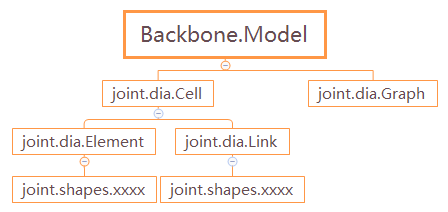
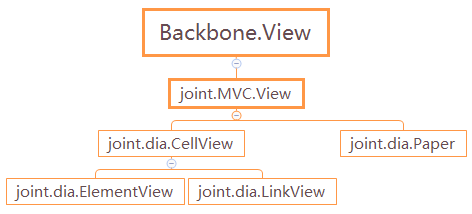
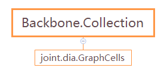

## JointJS的结构分析

JointJS库导出三个全局变量：joint，v和g。

- **v** —— 是一个称为Vectorizer的轻量级SVG库，可以使SVG文档的操作更容易。JointJS在内部使用此库。通常情况下，除了高级用途之外，用户不需要使用此库。
- **g **—— JointJS内部使用的轻量级库，提供很多有用的几何操作。用户一般不需要使用此库，但是当你需要在应用程序中执行几何操作时，这个库会很实用。
- **joint **—— joint命名空间包含了用于构建图表的所有对象。

## Joint

JointJS使用Backbone MVC库构建，Backbone提供了Model，View，Collection——构建应用程序的骨架。构建图表的所有对象都包含在joint命名空间中，我们对照Backbone的结构来分析joint的主要结构。

### Backbone的Model,View,Collection

Backbone.js为Web应用程序提供了结构，为models模型提供键值绑定和自定义事件，为collections提供丰富的API，为views视图提供声明式事件处理。

Backbone中，将数据表示为Models，可以创建、验证、销毁以及保存到服务器。当UI操作引起model的属性发生变化，model会触发一个“change"事件。

所有显示model状态的Views都可以被通知更改，以便能做出相应的响应，从而使用新信息重新呈现自己。

#### 1. Models and Views


Backbone可以将业务逻辑和用户界面分开。

##### Models

- 编排数据和业务逻辑
- 从服务器加载和保存
- 数据更改时发送事件

Model管理数据属性的内部表，并在修改任何数据时触发“change”事件。模型负责与持久层同步数据 - 通常是具有后备数据库的REST API。将模型设计为原子可重用对象，其中包含用于处理其特定数据位的所有有用函数。模型应该能够在整个应用程序中传递，并在需要数据位的任何地方使用。

##### Views

- 侦听更改并渲染UI
- 处理用户输入和交互
- 将捕获的输入发送给model

View是用户界面的原子块。它通常渲染来自某个或某些模型的数据——但是视图也可以是单独的无数据的UI块。Models通常应该不知道views。相反，view会侦听model的“change”事件，并给予适当的反应或重新渲染。

#### 2. Collections


Collection帮助处理一组关联models，处理加载models和保存新models到服务器的工作，并提供对models list执行聚合或计算的帮助函数。除了其自身的事件，collection还可以通过对其中的model发生的所有事件进行代理，来侦听其中任何model发生的事件。

### joint的主要模块

joint的主要模块就是按照Backbone的Model，View，Collection的骨架结构来构建应用程序的。

1. Models

model是核心，包含交互式数据及围绕它的大部分逻辑，如验证、转变、计算属性、访问控制等。

Cell，Element，Link和Graph属于Model，继承关系如下图所示：



joint.dia.Cell和joint.dia.Graph都继承自Backbone的Model，并添加了各自的附加属性和方法。

joint.dia.Element和joint.dia.Link都继承自joint.dia.Cell，并添加了一些elements/links特定的属性和方法。joint.shapes在joint.dia.Element和joint.dia.Link的基础上进行扩展来创建自定义形状。

##### joint.dia.Cell

继承自BackBone.Model，图表cells的基本模型。这是一个具有一些附加属性和方法的Backbone Model，具有唯一标识符，每个cell都有一个存储在id属性中的唯一ID。

##### joint.dia.Element

图表元素的模型。它从joint.dia.Cell继承，并添加了一些特定于元素的附加属性和方法。这些属性可以分为三组：

- Geometry

元素的坐标存储在position属性(具有x和y键的对象)中；旋转角度存储在angle属性中, 以度为单位，旋转原点始终被认为是元素的中心.；大小存储在size属性中，该属性是具有width和height键的对象。

position/angle/size可以使用常规Backbone set（）/ get（）方法或通过translate/rotate/resize方法直接访问或设置.

- Presentation

另一个重要属性是attrs，它是一个对象，其中的

1. key: 与子元素匹配的selectors
2. value: 将在子元素上设置的SVG属性。

在MDN上可以找到SVG属性列表和它们的描述。

值得注意的是，每个joint.dia.Element定义了一个SVG markup，然后由joint.dia.ElementView使用该markup将元素渲染/呈现给paper。

```javascript
// eg. joint.shapes.basic.Rect元素
joint.shapes.basic.Generic.define('basic.Rect', {
        attrs: { // 设置attrs属性
            'rect': {  // 设置矩形子元素的SVG属性，与markup中的矩形子元素对应
                fill: '#ffffff',
                stroke: '#000000',
                width: 100,
                height: 60
            },
            'text': {  // 设置文本子元素的SVG属性，与markup中的text子元素对应
                fill: '#000000',
                text: '',
                'font-size': 14,
                'ref-x': .5,
                'ref-y': .5,
                'text-anchor': 'middle',
                'y-alignment': 'middle',
                'font-family': 'Arial, helvetica, sans-serif'
            }
        }
    }, {
        //joint.shapes.basic.Rect元素定义的SVG markup
        markup: '<g class="rotatable"><g class="scalable"><rect/></g><text/></g>'
    });
```

注：修改属性时不建议直接更改attrs对象，建议使用attr方法。

z属性指定SVG DOM中元素的堆栈顺序。具有较高z等级的元素位于具有较低z等级的元素的前面。（这也适用于具有完全相同属性的link）

- Nesting

元素的最后两个属性是embeds和parent。这两个属性与包含或包含在其他元素中构成分层结构的元素有关。embeds是嵌入在元素内部的cell ID的列表，parent是embedded 元素的父元素的id。当一个父元素被translate时，它的所有孩子也会被translate。

##### joint.dia.Link

图表link的基本模型，继承自joint.dia.Cell，并添加了一些links特定的属性和方法。

links有两个关键属性：source和target，定义了link的起点和终点。

##### joint.shapes

提供了一些预定义的即时可用的形状（shapes）。在joint.shapes.standard中，提供了最常见形状（Rectangle，Circle，Path，Polygon，Image，Link等）的即用型高性能版本。形状可以原样使用，也可以在其基础上进行扩展来创建自定义形状。

##### joint.dia.Graph

是包含graph的所有cells（elements和links）的模型，是一个Backbone Model。

joint.dia.GraphCells继承自Backbone.Collection，是所有cells的collection，存储在graph的cells属性中。

graph是所有JointJS图表背后的强大数据模型。它不仅为directed graph提供了高效的存储，而且还为遍历graphs提供了有用的算法。

2. Views

Backbone的View并不是模板本身，却是一些控制类，它们处理模型的表现。

CellView，ElementView，LinkView和Paper属于View，继承关系如下图所示：



joint.MVC.View继承并扩展了Backbone.View，包含了JointJS中的视图的基本方法和属性。joint.dia.CellView和joint.dia.Paper都继承自joint.MVC.View。

joint.dia.Paper是joint.dia.Graph的视图，负责渲染关联的graph中的所有cells。

joint.dia.CellView是joint.dia.Cell的视图；joint.dia.ElementView和joint.dia.LinkView分别是joint.dia.Element和joint.dia.Link的视图。

##### joint.dia.CellView

joint.dia.Cell模型的view。继承自Backbone.View并负责：

- 渲染paper内的cell；
- 处理cell的pointer事件；
- 提供各种处理cell的方法（可视化）

##### joint.dia.ElementView

joint.dia.Element模型的视图，继承自 joint.dia.cellView。负责：渲染paper内的元素 ；处理元素的pointer事件 ；提供各种处理元素的方法（可视化）。

##### joint.dia.LinkView

joint.dia.Link模型的视图。继承自joint.dia.CellView，负责：

- 渲染paper内的link ；
- 处理link的pointer事件 ；提供各种处理link的方法（可视化）。

##### joint.dia.Paper

joint.dia.Paper是joint.dia.Graph模型的视图，继承自 joint.mvc.View（继承自Backbone.View），当paper与graph相关联时，paper会确保添加到graph中的所有cells都自动渲染。

#### 3. Collection



**joint.dia.GraphCells**继承自Backbone.Collection，是graph中的cells的有序集合，存储在graph的“cells”属性中。

Backbone.Collection是models的有序集合，可以绑定“change"事件，以便collection中的任何model被修改时通知。collection中的model触发的任何事件也将直接在collection上触发，允许监听collection中任何model中特定属性的更改。

### 其他模块

##### joint.dia.attributes

JointJS中的属性（attributes）定义了如何在element和link views中呈现图形元素(graphics elements)。可以使用所有标准SVG样式属性。

此外，JointJS定义了新的所谓“特殊”属性，并允许程序员定义自己的属性。

##### joint.env

提供接口，让用户添加自定义功能检测测试，用于测试浏览器是否支持给定功能。

##### joint.highlighters

用来为元素提供视觉强调，例如在用户交互期间，对元素进行高亮/ 非高亮处理。

##### joint.layout

图表的自动布局，该插件在内部使用开源（MIT许可证）Dagre库。它提供了一个包装器，以便您可以直接在JointJS图上调用布局。

注意，如果您希望使用layout.DirectedGraph插件，则必须同时包含Dagre和Graphlib库作为依赖关系。

##### joint.util

提供了一些通用的便利函数，供JointJS内部使用。

